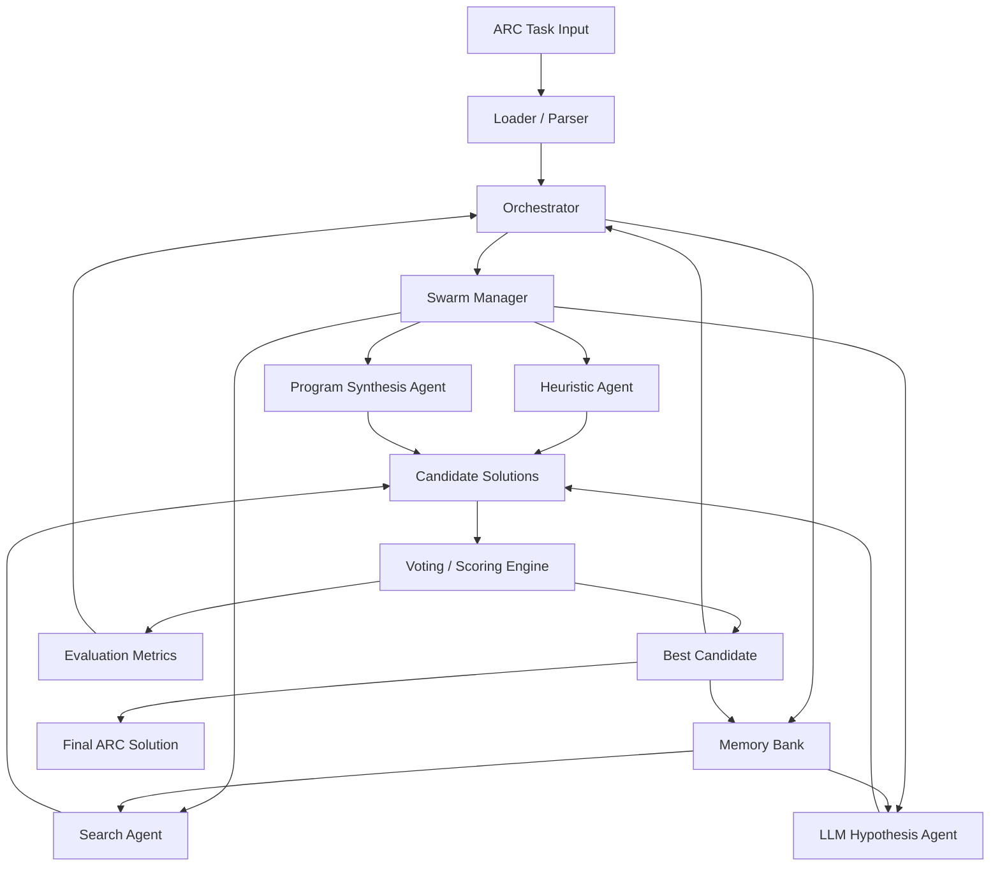
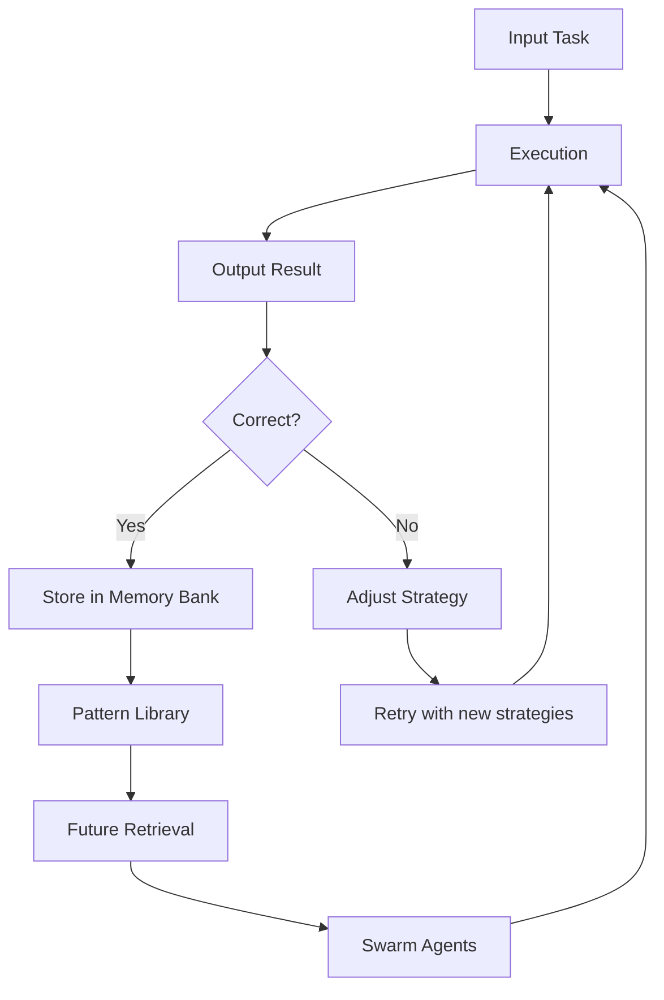
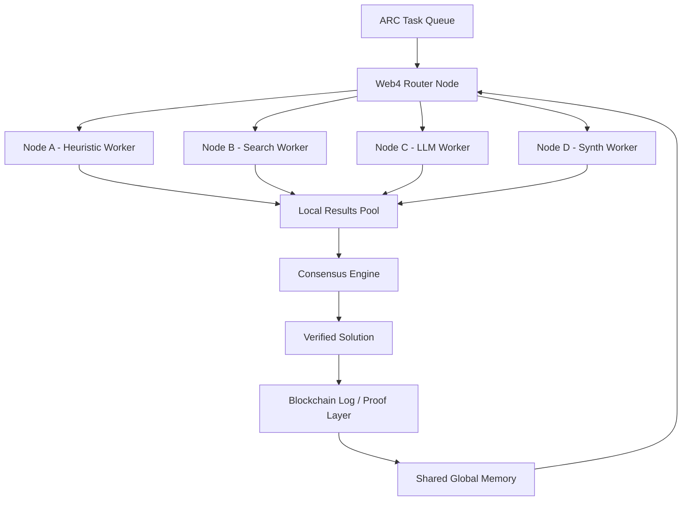
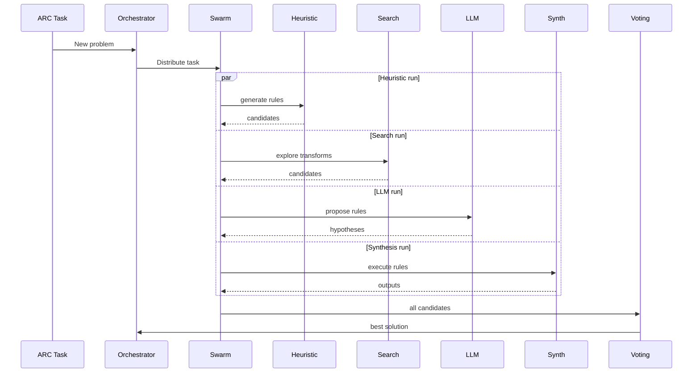

>
```index.html

<iframe src="https://www.kaggle.com/embed/auraecosystem/arc-agi-3-duck-balanced-ternary-10d-int4sp-v6?kernelSessionId=341336440" height="800" style="margin: 0 auto; width: 100%; max-width: 950px;" frameborder="0" scrolling="auto" title="Arc Agi 3 Duck Balanced Ternary 10d Int4sp V6" ><iframe\>


```
# ARC-AGI-3-Agents

> ## Quickstart

Install [uvx](https://docs.astral.sh/uv/getting-started/installation/) if not aready installed.

1. Clone the ARC-AGI-3-Agents repo and enter the directory.

```bash
git clone https://github.com/auraecosystem/ARC-AGI-3-Agentops.git
cd ARC-AGI-3-Agentops
```

```bash
kaggle competitions submit -c arc-prize-2026-paper-track -f submission.csv -k auraecosystem/<NOTEBOOK> -v <VERSION> -m "Message"
```

```shell
wget -qO- https://astral.sh/uv/install.sh | sh
kaggle kernels pull bjoernjostein/physionet-challenge-utility-script
```

```python
from kaggle_secrets import UserSecretsClient
user_secrets = UserSecretsClient()
secret_value_0 = user_secrets.get_secret("Api")
```

2. Copy .env.ini to .env

```bash
cp .env.example .env
```
> # SWARM SRUCTURE

3. Get an API key from the [ARC-AGI-3 Website](https://three.arcprize.org/) and set it as an environment variable in your .env file.

```.bashrpc
export ARC_API_KEY="your_api_key_here"
```

4. Run the random agent (generates random actions) against the ls20 game.

```bash.sh
uv run main.py --agent=random --game=ls20
```

For more information, see the [documentation](https://three.arcprize.org/docs#quick-start) or the [tutorial video](https://youtu.be/xEVg9dcJMkw).

## Changelog
## [0.9.3] - 2026-01-29
**Note: This will be a breaking change is you use the fields outline below**
```console
>_ kaggle competitions submit -c arc-prize-2026-arc-agi-3 -f submission.parquet -k auraecosystem/<NOTEBOOK> -v <13> -m "Message"
```

> ### Added
- `FrameData` had two field names changes. 
  - `score` changed to `levels_completed`
  - `win_score` changed to `win_levels`
- Updated to use the new [ARC-AGI](https://github.com/arcprize/ARC-AGI) tool
  - Allows local execution of environments
  - Allows the creation of your own environments, see [Creating an Environment](https://docs.arcprize.org/add_game)
  - If you want to continue to use the online API/Replays set `ONLINE_ONLY` to `True` in `.env.example`

## [0.9.2] - 2025-08-19

### Added
- `available_actions` to `FrameData`
- `ACTION7` as possible `GameAction`


```ascii

                OBSERVATION
                     ↓
            ┌─────────────────┐
            │ WORLD MODEL     │
            └─────────────────┘
                     ↓
        ┌─────────────────────────┐
        │ SWARM INTELLIGENCE      │
        │ - Explorer              │
        │ - Planner               │
        │ - Critic                │
        └─────────────────────────┘
                     ↓
            ┌─────────────────┐
            │ Q-LEARNING CORE │
            └─────────────────┘
                     ↓
            ┌─────────────────┐
            │ MEMORY SYSTEM    │
            └─────────────────┘
                     ↓
            ┌─────────────────┐
            │ ACTION EXECUTION │
            └─────────────────┘
                     ↓
                ENVIRONMENT

```
[Initial Release]

[web4]



## Observability (Optional)

[AgentOps](https://agentops.ai/) is an observability platform designed for providing real-time monitoring, debugging, and analytics for your agent's behavior, helping you understand how your agents perform and make decisions.

### Installation

AgentOps is already included as an optional dependency in this project. To install it:

```bash
uv sync --extra agentops
```

Or if you're installing manually:

```uv
pip install -U agentops
kaggle kernels pull auraecosystem/modelhai-parque
gcloud auth configure-docker \
    us-docker.pkg.dev
```

### Getting Your API Key

1. Visit [app.agentops.ai](https://app.agentops.ai) and create an account if you haven't already
2. Once logged in, click on "New Project" to create a project for your ARC-AGI-3 agents
3. Give your project a meaningful name (e.g., "ARC-AGI-3-Agents")
4. After creating the project, you'll see your project dashboard
5. Click on the "API Keys" tab on the left side & copy the API key

> ### Configuration/execution


1. Add your AgentOps API key to your `.env` file:

```bash
AGENTOPS_API_KEY=“6611b1a63a0952268a3f44fdb724c1f2/arc-agi-3-duck-balanced-ternary-10d-int4sp-v6”
```

[physionet](https://www.kaggle.com/code/bjoernjostein/physionet-challenge-utility-script?cellIds=1&kernelSessionId=68680130)
2. The AgentOps integration is automatically initialized when you run an agent. The tracing decorator `@trace_agent_session` is already applied to agent execution methods in the codebase.

3. When you run your agent, you'll see AgentOps initialization messages and session URLs in the console:
>
> 
```bash
🖇 AgentOps: Session Replay for your-agent-name: https://app.agentops.ai/sessions?trace_id=xxxxx
```

4. Click on the session URL to view real-time traces of your agent's execution. You can also view the traces in the AgentOps dashboard by locating the trace ID in the "Traces" tab.

> ### Using AgentOps with Custom Agents

If you're creating a custom agent, the tracing is automatically applied through the `@trace_agent_session` decorator on the `main()` method. No additional code changes are needed.


## Contest Submission


To submit your agent for the ARC-AGI-3 competition, please use this form: https://forms.gle/wMLZrEFGDh33DhzV9.

## Contributing

We welcome contributions! To contribute to ARC-AGI-3-Agents, please follow these steps:

1.  Fork the repository and create a new branch for your feature or bugfix.
2.  Make your changes and ensure that all tests pass, you are welcome to add more tests for your specific fixes.
3.  This project uses `ruff` for linting and formatting. Please set up the pre-commit hooks to ensure your contributions match the project's style.
   ```bash
    pip install pre-commit
    pre-commit install
   ```

[auraecosystem/arc-agi-3-duck-balanced-ternary-10d-int4sp-v6](https://www.kaggle.com/code/auraecosystem/arc-agi-3-duck-balanced-ternary-10d-int4sp-v6?kernelSessionId=341336440)
```inded.html

<iframe src="https://www.kaggle.com/embed/auraecosystem/arc-agi-3-duck-balanced-ternary-10d-int4sp-v6?kernelSessionId=341336440" height="800" style="margin: 0 auto; width: 100%; max-width: 950px;" frameborder="0" scrolling="auto" title="Arc Agi 3 Duck Balanced Ternary 10d Int4sp V6"></iframe>
```
5.  Write clear commit messages describing your changes.
6.  Open a pull request with a description of your changes and the motivation behind them.

If you have questions or need help, feel free to open an issue.

## What changed
- Added swarm-based decision system
- Improved memory tracking
- Added structured agent loop

## Why
This improves reasoning consistency and prepares the system for ARC-style tasks.

## Testing
- Ran pre-commit hooks
- Verified environment step loop works
- Tested multiple episodes successfully


> ## Tests

To run the tests, you will need to have `pytest` installed. Run the tests like this:

```bash
pytest
```

For more information on tests, please see the [tests documentation](https://three.arcprize.org/docs#testing).

## License

This project is licensed under the MIT License. See the [LICENSE](LICENSE) file for details.
